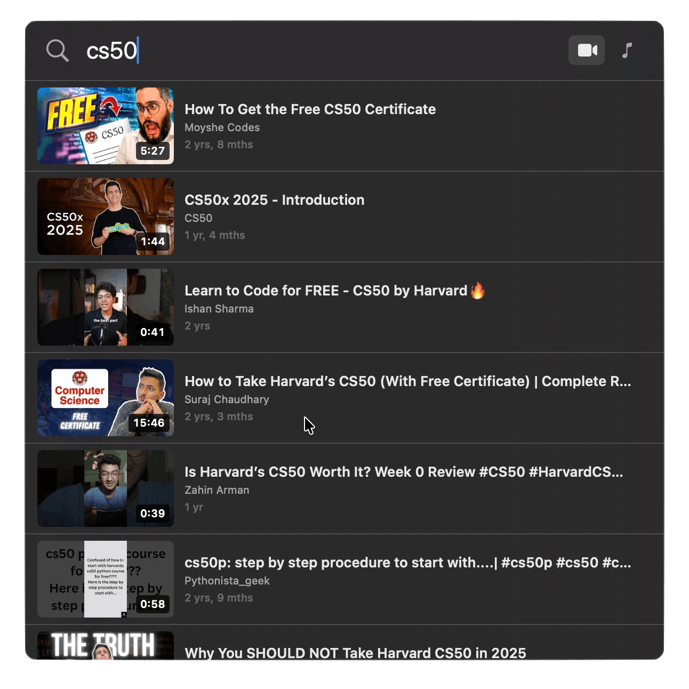
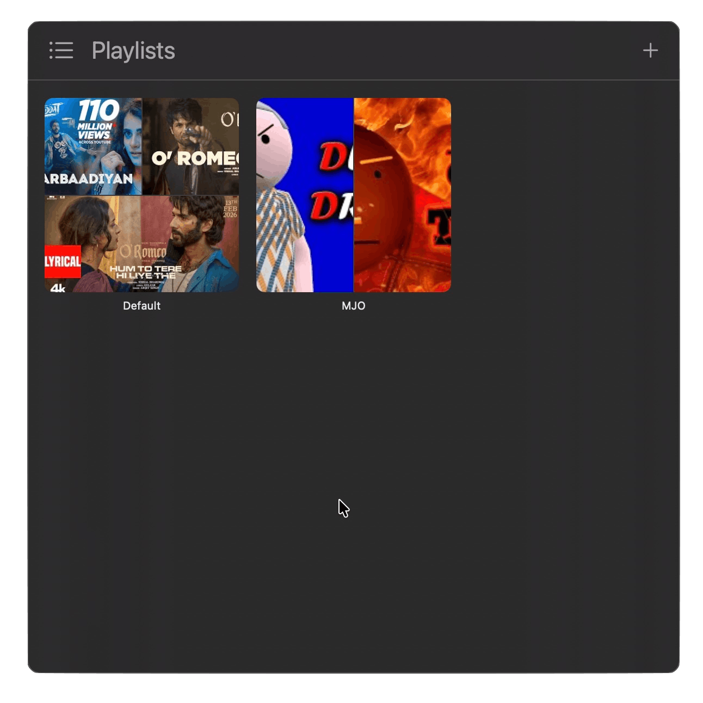
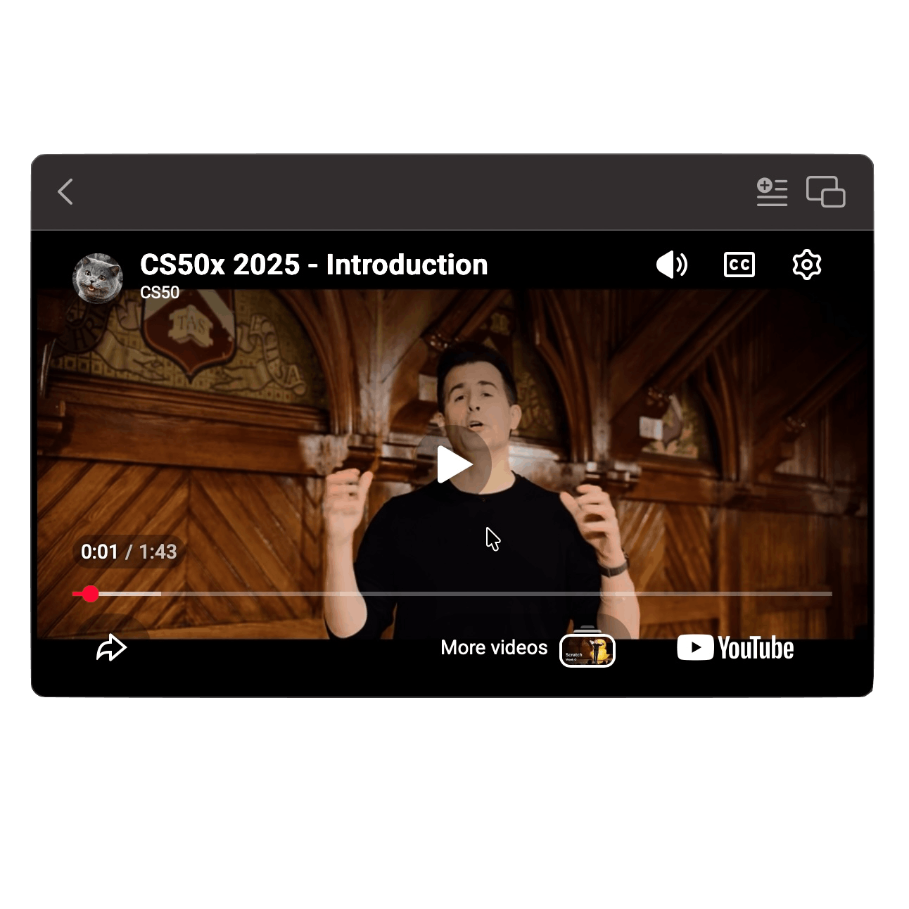
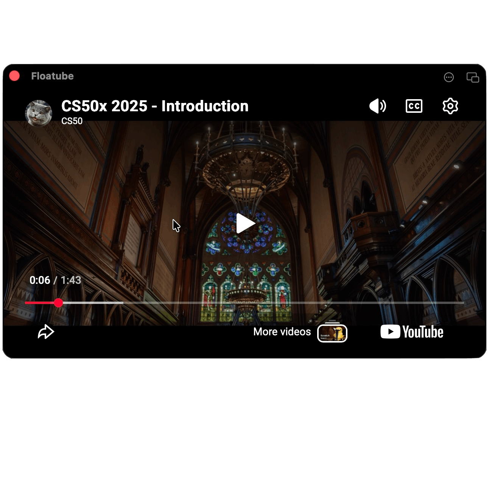

<div align="center">


# Floatube

**YouTube on top. Always.**

A featherweight macOS menu-bar player. Hit a shortcut, type, watch — in a floating window that stays above everything else while you work.

<p>
  
  
  
  
  
</p>

<a href="#install"><strong>Install</strong></a> ·
<a href="#features"><strong>Features</strong></a> ·
<a href="#setup-1-minute"><strong>Setup</strong></a> ·
<a href="#usage"><strong>Usage</strong></a> ·
<a href="#build-from-source"><strong>Build</strong></a>

</div>

---

## Why Floatube

Most YouTube clients want to be browsers. Floatube doesn't.

It lives in your menu bar, takes no space in the Dock, and pops a search field down from the top of your screen the moment you press a shortcut. Pick a video — it opens in a small, always-on-top window you can park in any corner, dim with an opacity slider, and keep on while you write code, take notes, or read.

> Background music, tutorials, that talk you said you'd watch "later" — Floatube is built for the YouTube you keep in the corner of your screen.

---

## Screens

<table>
  <tr>
    <td align="center" width="50%">
      
      <br />
      <sub><strong>Search</strong> — type to find videos; recent searches.</sub>
    </td>
    <td align="center" width="50%">
      
      <br />
      <sub><strong>Playlists</strong> — build local queues that auto-advance to the next track.</sub>
    </td>
  </tr>
  <tr>
    <td align="center" width="50%">
      
      <br />
      <sub><strong>Inline player</strong> — pick a result and watch right inside the dropdown panel.</sub>
    </td>
    <td align="center" width="50%">
      
      <br />
      <sub><strong>Floating player</strong> — detach into an always-on-top window.</sub>
    </td>
  </tr>
</table>

---

## Features

| | |
|---|---|
| **Menu bar only** | No Dock icon, no app-switcher noise. Lives next to the clock. |
| **Global hotkey** | Default `⌘⇧Y`. Fully rebindable to any modifier combo. |
| **Floating player** | Stays above other windows. Set opacity, snap to any corner, fullscreen on demand. |
| **Inline or Detached** | Watch in the dropdown panel, or pop the player out into its own window. |
| **Resume where you left off** | Reopens the panel showing your last video at the right timestamp. |
| **Playlists** | Build local playlists, queue them up, auto-advance to the next track. |
| **Search history** | Recent searches surface instantly when the panel opens. |
| **Multi-key quota fallback** | Add several YouTube API keys; Floatube rotates through them when a key hits quota. |
| **Keychain-backed keys** | Your API keys live in the macOS Keychain, never in a config file. |
| **Universal binary** | One DMG, runs natively on Apple Silicon and Intel. |

---

## Install

### Option A — Download the DMG

1. Grab the latest **`floatube-x.y.z.dmg`** from the [Releases page](../../releases).
2. Open the DMG and drag **Floatube** into **Applications**.
3. **First launch:** in Applications, **right-click → Open** → confirm in the dialog.
   *(macOS shows a warning because Floatube is not paid-Apple-Developer notarized. Subsequent launches open normally.)*

> If macOS still refuses, run once in Terminal:
> ```bash
> xattr -dr com.apple.quarantine /Applications/floatube.app
> ```

### Option B — Build from source

See [Build from source](#build-from-source) below.

---

## Setup (1 minute)

Floatube uses the official YouTube Data API to search. You bring your own free API key.

The Settings window walks you through it, but here's the short version:

1. Open **<https://console.cloud.google.com>** and create (or select) a project.
2. **APIs & Services → Library →** search **"YouTube Data API v3"** → **Enable**.
3. **APIs & Services → Credentials → Create Credentials → API key**.
4. Copy the key.
5. In Floatube: menu-bar icon → right-click → **Settings → Keys** → paste → **Add**.

> **Tip — quota.** The free YouTube API tier gives ~100 searches/day per key. Floatube lets you add **multiple keys** and automatically falls back to the next one when a key is rate-limited. Create a second project in Google Cloud, generate a second key, paste it into the Keys list, done.

---

## Usage

| Action | How |
|---|---|
| **Open / close panel** | `⌘⇧Y` (or click the menu-bar icon) |
| **Search** | Just type. Results appear as you go. |
| **Play inline** | Click any result. |
| **Detach to floating window** | Detach button on the player (or set Default Mode → Detached). |
| **Re-attach to panel** | Attach button on the floating window. |
| **Next / Previous in playlist** | Right-click the menu-bar icon, or controls on the player. |
| **Add to playlist** | More menu (⋯) on the player → Add to Playlist. |
| **Share** | More menu (⋯) on the player → Share. |
| **Fullscreen** | More menu (⋯) → Fullscreen, or double-click the player. |
| **Quit** | Right-click menu-bar icon → Quit. |

---

## Settings reference

Open with `⌘,` from the menu, or right-click the menu-bar icon → Settings.

**General**
- **Open** — what the panel shows when summoned: *Search* or *Playlist*.
- **Last Played** — show the resume-card at the top of the panel (on by default).

**Player**
- **Mode** — *Inline* (in-panel) or *Detached* (floating window) by default.
- **Placement** — *Center / Top Left / Top Right / Bottom Left / Bottom Right* for the detached player.
- **Opacity** — 30–100% transparency for the floating window.

**Shortcut**
- Click **Open Floatube** field, press the combo you want. Use any of `⌘ ⇧ ⌥ ⌃` plus a key.

**Keys**
- Manage your YouTube Data API keys. Stored in the macOS Keychain. Multiple keys → automatic quota fallback.

---

## Acknowledgments

- [YouTubePlayerKit](https://github.com/SvenTiigi/YouTubePlayerKit) by Sven Tiigi — the heavy lifting for the IFrame player.
- The YouTube Data API team for keeping the search endpoint free and stable.

---

## License

Floatube is released under the [MIT License](LICENSE) — © 2026 Ameer.

You can use, copy, modify, and redistribute the code freely, in personal or commercial projects, as long as the copyright notice is preserved. The software comes with no warranty.

---

<div align="center">

Built for the corner of your screen.

</div>
